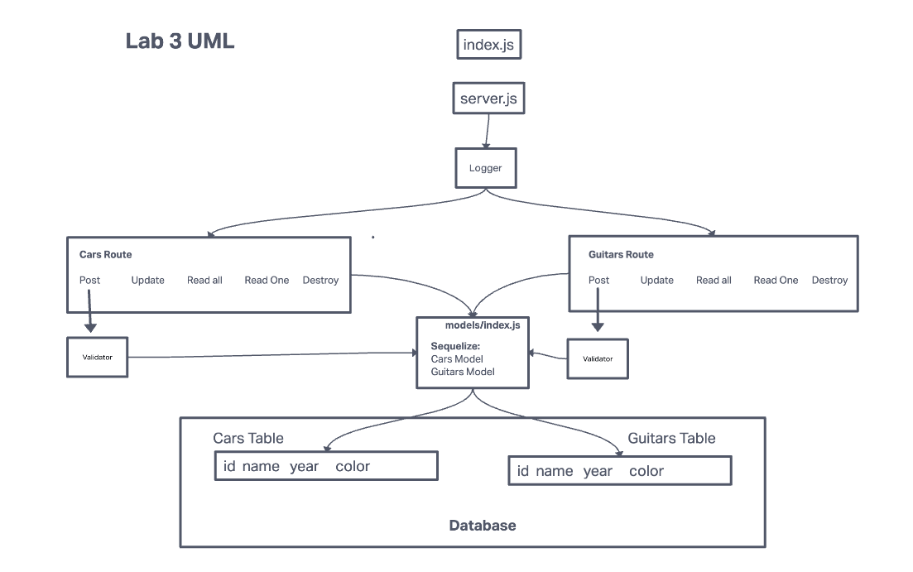

# LAB - Class 03: Basic API Server

Author: Stephen Clemmer

### Links and Resources

back-end server url: https://basic-api-server-sjc.herokuapp.com/

PORT - 3001

**Problem Domain**
A basic API server that does the following:

1. Uses a logger middlewareto record the request method and requerst URL before get, post, update, and delete requests are made.
2. Uses validator middleware to validate that a post request fits the structure outlined in the schema
3. Uses an models/index file to:
    a. Route which data base will be used in the development, testing, and production phases.
    b. Create a class for each type of Schema by passing in the arguments of sequelizeDatabase and DataTypes so that the model can access the methods associated with sequelizeDatabase and DataTypes. This class will be exported so that it may be required into its respective router.
4. Creates a database for each model class, fom which one may create, read, update, and delete entries.

**UML**

**Tests**
404 on a bad route
Error if no name is in the query string
The correct status codes and returned data for each

**File Structure**
├── .gitignore
├── .eslintrc.json
├── config
│   ├── config.json
├── \__tests__
│   ├── server.test.js
│   ├── logger.test.js
├── src
│   ├── error-handlers
│   │   ├── 404.js
│   │   ├── 500.js
│   ├── middleware
│   │   ├── logger.js
│   │   ├── validator.js
│   ├── models
│   │   ├── index.js
│   │   ├── food.js
│   │   ├── clothes.js
│   ├── routes
│   │   ├── food.js
│   │   ├── clothes.js
│   ├── server.js
├── index.js
└── package.json

### Features

- index.js at the root of your repository, which will act as the “entry point” to your server.
- should require src/server.js
- should require dotenv, reading PORT from your .env file
- It should call the .start() method from the server with the PORT set in your environment
- src/server.js which will serve as your server ‘module’ … will contain all of the module connections for the server
- Must export an object with a start() method (it should not start on it’s own) and a reference to the express app

**Create a middleware folder and add 2 middleware modules to it:**

1. logger.js: Performs a console.log with the request method and path. Import this into your server and set it up to run at the application level for all routes
2. validator.js: Checks the query string on a post request for a name property. Sends the request through when valid, forces an error when not. If valid, send a JSON object through the response with the name value in it
i.e. {"name": "fred" }

**Create a error-handlers folder and add 2 modules to it:**

1. 404.js: Sends a 404/Not-Found message as the response. Import this into your server and set it up to be “used” after your other routes
2. 500.js: Sends a 500/Server Error message as the response. Import this into your server and set it up to be “used” as the last route

### Routes

**Add a Record**
CRUD Operation: Create
REST Method: POST
Path1: /cars
Path2: /guitars
Input: JSON Object in the Request Body
Returns: The record that was added to the database.
You must generate an ID and attach it to the object.
You should verify that only the fields you define get saved as a record.

**Get All Records**
CRUD Operation: Read
REST Method: GET
Path1: /cars
Path2: /guitars
Returns: An array of objects, each object being one entry from your database.

**Get One Record**
CRUD Operation: Read
REST Method: GET
Path1: /cars/id
Path2: /guitars/id
Returns: The object from the database, which has the id matching that which is in the path.

**Update a Record**
CRUD Operation: Update
REST Method: PUT
Path1: /cars/id
Path2: /guitars/id
Input: JSON Object in the Request Body
Returns: The object from the database, which has the id matching that which is in the path, with the updated/changed data.
You should verify that only the fields you define get saved as a record.

**Delete a Record**
CRUD Operation: Destroy
REST Method: DELETE
Path1: /cars/id
Path2: /guitars/id
Returns: The record from the database as it exists after you delete it (i.e. null).
